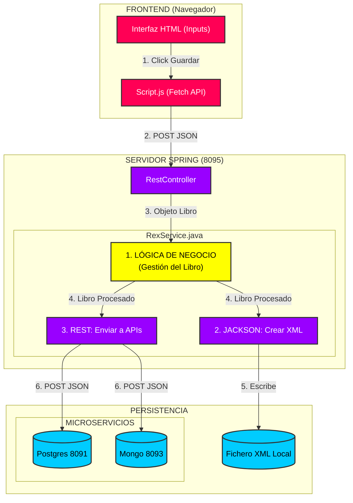
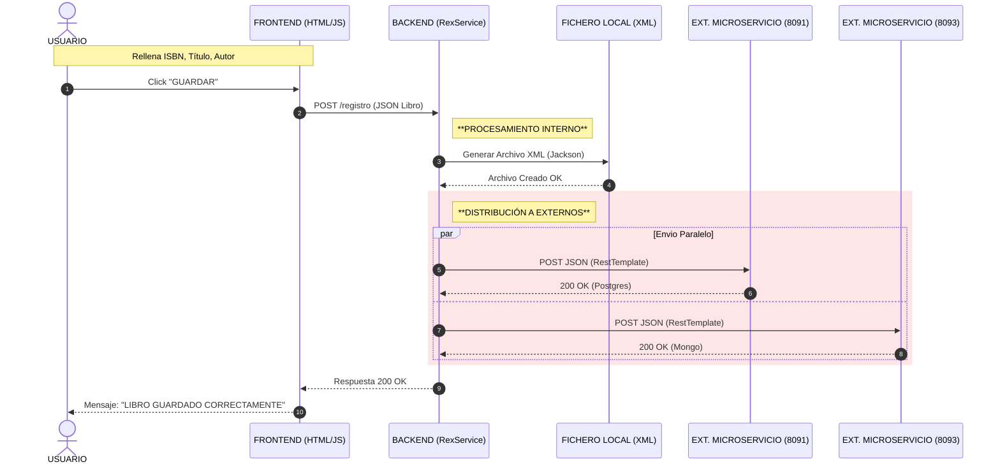

# MICROSERVICIO CHETADO 🪽

---

> [!WARNING]
> ***EL OBJETIVO DE ESTE MICROSERVICIO ES GESTIONAR EL INVENTARIO DE UNA BIBLIOTECA***

- ***El sistema implementa un patrón de persistencia políglota, almacenando simltáneamente en tres formatos distintos***
  
  - ***ARCHIVOS XML***
  - ***BASE DE DATOS RELACIONAL (POSTGRESQL)***
  - ***BASE DE DATOS NO RELACIONAL (MONGODB)***

---

## ARQUITECTURA DEL SISTEMA 🥎

### FRONTEND ⭕

> [!NOTE]
> ***INTERFAZ DE USUARIO, NO TIENE LÓGICA DE NEGOCIO, SOLO CAPTURA LOS DATOS Y LOS ENVÍA AL BACKEND***

- ***Esta página web nunca habla directamente con las bases de datos, ese rol lo tiene `con-external`***
  
  - **DISEÑO**
   
  

### CON-EXTERNAL

> [!NOTE]
> ***ES EL INTERMEDIARIO, SIENDO EL ÚNICO PUNTO DE CONTACTO CON EL FRONTEND***

- ***Recibe peticiones de usuario y decide a quién llamar***
  - ****Para escirbir (POST) = Delega el trabajo al orquestador***
  - ***PARA LEER (GET) = Consulta directamente ***

---

## MERMAID PARA ENTENDER LA ARQUITECTURA Y FUNCIONAMIENTO 🏡

