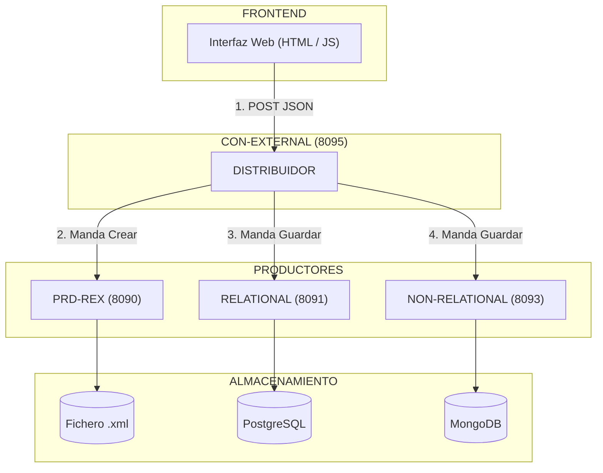
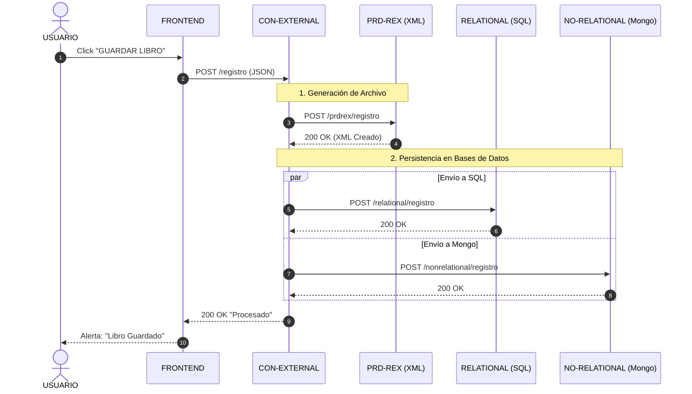

# MICROSERVICIO CHETADO 🪽


---

> [!WARNING]
> ***EL OBJETIVO DE ESTE SERVICIO ES GESTIONAR EL INVENTARIO DE UNA BIBLIOTECA***

- ***El sistema implementa un patrón de persistencia políglota, almacenando simltáneamente en tres formatos distintos***
  
  - ***ARCHIVOS XML***
  - ***BASE DE DATOS RELACIONAL (POSTGRESQL)***
  - ***BASE DE DATOS NO RELACIONAL (MONGODB)***

---

## ARQUITECTURA DEL SISTEMA 🔺



---

### ***FRONTEND http://localhost:8095/index.html 🔻***

> [!NOTE]
> ***INTERFAZ DE USUARIO, NO TIENE LÓGICA DE NEGOCIO, SOLO CAPTURA LOS DATOS Y LOS ENVÍA AL BACKEND***

- ***Esta página web nunca habla directamente con las bases de datos, ese rol lo tiene `con-external`, el orquestador***
  
  - ***DISEÑO 💗💗***
  <br>
  

---

### ***CON-EXTERNAL 8095🔻***

> [!NOTE]
> ***ES EL INTERMEDIARIO, SIENDO EL ÚNICO PUNTO DE CONTACTO CON EL FRONTEND***

- ***Recibe peticiones de usuario y decide a qué microservicio llamar basándose en la intención del usuario (Depende de la petición del usuario en la web)***
  
  - ***Para escirbir (POST) = Se encarga de distribuir el libro a los 3 destinos, manda crear un XML en `prd-rex` y ordena guardar en `Postgres` y `Mongo`***
  - ***PARA LEER (GET) = Consulta directamente a la base de datos relacional para máxima velocidad***


<br>
<br>

- ***DATOS FNDAMENTALES***

```java

@Service
public class LibroService {

    @Autowired
    private RestTemplate rest;

    // ENVIAR EL LIBRO AL RESTO DE MICROSERVICIOS
    public void enviarLibro(Libro libro) {

        // ENVIAMOS A PRD-REX (PARA QUE HAGA EL XML)
        try {
            String urlRex = "http://localhost:8090/api/v1/prdrex/registro";
            rest.postForObject(urlRex, libro, String.class);
        } catch (Exception e) {
            System.out.println("ERROOORCH AL ENVIAR A PRD-REX: " + e.getMessage());
        }

        // CABECERAS JSON PARA LAS BASES DE DATOS
        HttpHeaders headers = new HttpHeaders();
        headers.setContentType(MediaType.APPLICATION_JSON);
        HttpEntity<Libro> request = new HttpEntity<>(libro, headers);

        // ENVIAMOS A RELATIONAL (POSTGRES)
        try {
            String urlSql = "http://localhost:8091/api/v1/relational/registro";
            rest.postForObject(urlSql, request, String.class);
        } catch (Exception e) {
            System.out.println("ERRORRR AL ENVIAR A POSTGRES: " + e.getMessage());
        }

        // A NON-RELATIONAL (MONGO)
        try {
            String urlMongo = "http://localhost:8093/api/v1/nonrelational/registro";
            rest.postForObject(urlMongo, request, String.class);
        } catch (Exception e) {
            System.out.println("ERRORRR AL ENVIAR A MONGO: " + e.getMessage());
        }
    }

    // GET POR ISBN
    public Libro buscarPorIsbn(String isbn) {
        String url = "http://localhost:8091/api/v1/relational/consulta/isbn/" + isbn;
        try {
            return rest.getForObject(url, Libro.class);
        } catch (Exception e) {
            return null;
        }
    }

    // GET POR NOMBRE
    public Libro[] buscarPorNombre(String nombre) {
        String url = "http://localhost:8091/api/v1/relational/consulta/nombre/" + nombre;
        try {
            return rest.getForObject(url, Libro[].class);
        } catch (Exception e) {
            return null;
        }
    }
}


// EN EL CONTROLLER

@RestController
@RequestMapping("/api/v1/libros")
public class RestLibro {

    @Autowired
    private LibroService libroService;

    // ESCUCHA DE PETICIONES POST EN /REGISTRO
    @PostMapping("/registro")
    public ResponseEntity<String> registrarLibro(@RequestBody Libro libro) {
        libroService.enviarLibro(libro);

        // PARA SABER SI SE REALIZÓ DE FORMA CORRECTA O NO
        return ResponseEntity.ok("LIBRO PROCESADO Y ENVIADO A TODOS LOS SERVICIOS CON EXXXITOOOO = " + libro.getNome());
    }

    // GET POR ISBN
    @GetMapping("/consulta/isbn/{isbn}")
    public ResponseEntity<Libro> consultarPorIsbn(@PathVariable String isbn) {
        Libro libro = libroService.buscarPorIsbn(isbn);
        if (libro != null) {
            return ResponseEntity.ok(libro);
        }
        return ResponseEntity.notFound().build();
    }

    // GET POR NOMBRE
    @GetMapping("/consulta/nombre/{nombre}")
    public ResponseEntity<Libro[]> consultarPorNombre(@PathVariable String nombre) {
        Libro[] libros = libroService.buscarPorNombre(nombre);
        if (libros != null && libros.length > 0) {
            return ResponseEntity.ok(libros);
        }
        return ResponseEntity.notFound().build();
    }
}

```

---


### ***PRD-REX 8090 🔻***

>[!TIP]
> ***MICROSERVICIO DEDICADO A LA PERSISTENCIA DE FICHEROS, SU ÚNICA RESPONSABILIDAD ES GARANTIZAR QUE EXISTE UNA COPIA FÍSICA DEL DATO EN EL SERVIDOR***

- ***Utiliza la librería jackson XML para serializar los objetos java recibidos a formato XML***
- ***Genera ficheros con nomenclatura `registro_[ISBN].xml` en ek directorio local***


<br>
<br>


- ***DATOS FUNDAMENTALES***

```java

// EN EL SERVICE - DEFINIMOS LA CREACIÓN DEL XML

    public void procesarLibro(Libro libro) {
        crearXml(libro);
    }
    private void crearXml(Libro libro) {
        try {
            // HE DECIDIDO QUE EL NOMBRE DEL ARCHIVO SERÁ "REGISTRO" + SU ISB PARA MEJOR BÚSQUEDA
            String nombreArchivo = "registro_" + libro.getIsbn() + ".xml";
            File archivo = new File(nombreArchivo);

            // INICIALIZAMOS JACKSON
            XmlMapper xmlMapper = new XmlMapper();
            xmlMapper.registerModule(new JavaTimeModule());
            xmlMapper.disable(SerializationFeature.WRITE_DATES_AS_TIMESTAMPS);

            xmlMapper.enable(SerializationFeature.INDENT_OUTPUT);
            xmlMapper.configure(ToXmlGenerator.Feature.WRITE_XML_DECLARATION, true);
            xmlMapper.writeValue(archivo, libro);

        } catch (Exception e) {
            System.out.println("ERROOORCH AL ESCRIBIR XML: " + e.getMessage());
        }
    }

// EN EL CONTROLLER - ENDPOINTS PARA MAPEAR

@RestController
// RUTA BASE DE ESTE MICROSERVICIO (LA MISMA A LA QUE LLAMA CON-EXTERNAL)
@RequestMapping("/api/v1/prdrex")
public class RestRex {

    @Autowired
    private RexService rexService;

    @PostMapping("/registro")
    public ResponseEntity<String> registrar(@RequestBody Libro libro) {

        // PROCESAMOS EL LIBRO
        rexService.procesarLibro(libro);

        // DEVOLVEMOS QUE TODO HA IDO BIEN
        return ResponseEntity.ok("REGISTRO XML CREADO CORRECTAMENTE PARAAAA EL LIBRO = " + libro.getNome());
    }

```

---

### ***RELATIONAL-PRD-QUERY 8091***

>[!NOTE] 
> ***USA POSTGRES PARA GUARDAR LOS DATOS ESTRUCTURADOS Y REALIZAR BÚSQUEDAS RÁPIDAS***

- ***Mantiene la integridad referencial de los datos***
- ***Expone endpoints para la inserción y consulta***


<br>
<br>


- ***DATOS FUNDAMENTALES***

```java
@RestController
// RUTA BASE, COINCIDIENDO CON LA QUE ENVIA CON-EXTERNAL
@RequestMapping("/api/v1/relational")
public class RestLibro {

    @Autowired
    private LibroService libroService;

    @PostMapping("/registro")
    public ResponseEntity<String> registrar(@RequestBody Libro libro) {
        libroService.guardarLibro(libro);
        return ResponseEntity.ok("LIBRO ALMACENADO EN POSTGRESSSS");
    }
    // ENDPOINT PARA BUSCAR POR ISBN DIRECTAMENTE EN LA URL
    @GetMapping("/consulta/isbn/{isbn}")
    public ResponseEntity<Libro> consultarPorIsbn(@PathVariable String isbn) {
        Optional<Libro> libro = libroService.buscarPorIsbn(isbn);
        return libro.map(ResponseEntity::ok).orElseGet(() -> ResponseEntity.notFound().build());
    }

    // ENDPOINT PARA BUSCAR POR NOMBRE
    @GetMapping("/consulta/nombre/{nome}")
    public ResponseEntity<List<Libro>> consultarPorNome(@PathVariable String nome) {
        List<Libro> libros = libroService.buscarPorNome(nome);
        if (libros.isEmpty()) {
            return ResponseEntity.notFound().build();
        }
        return ResponseEntity.ok(libros);
    }

}

```

---

### ***NON RELATIONAL-PRD-QUERY***

>[!NOTE] 
> ***USA MONGODB PARA GUARDAR EL DOCUMENTO JSON COMO RESPALDO NoSQL***

- ***Proporciona redundancia de datos en formato BSON***
- ***Su función es servir como backup flexible, permitiendo recuperar la información incluso si la estructura relacional se corrompiera***


- ***DATOS FUNDAMENTALES***

```java

@RestController
@RequestMapping("/api/v1/nonrelational")
public class LibroController {

    @Autowired
    private LibroService libroService;

    @PostMapping("/registro")
    public ResponseEntity<String> registrar(@RequestBody Libro libro) {
        libroService.guardarLibro(libro);
        return ResponseEntity.ok("LIBRO GUARDADO CON EXITOOO EN MONGO");
    }

    // ENDPOINT PARA BUSCAR POR ISBN
    @GetMapping("/consulta/isbn/{isbn}")
    public ResponseEntity<Libro> consultarPorIsbn(@PathVariable String isbn) {
        Optional<Libro> libro = libroService.buscarPorIsbn(isbn);
        return libro.map(ResponseEntity::ok).orElseGet(() -> ResponseEntity.notFound().build());
    }

    // ENDPOINT PARA BUSCAR POR NOMBRE
    @GetMapping("/consulta/nome/{nome}")
    public ResponseEntity<List<Libro>> consultarPorNome(@PathVariable String nome) {
        List<Libro> libros = libroService.buscarPorNome(nome);
        if (libros.isEmpty()) {
            return ResponseEntity.notFound().build();
        }
        return ResponseEntity.ok(libros);
    }
}
```


---


### ***MERMAID PARA ENTENDER EL FUNCIONAMIENTO 🔺***





