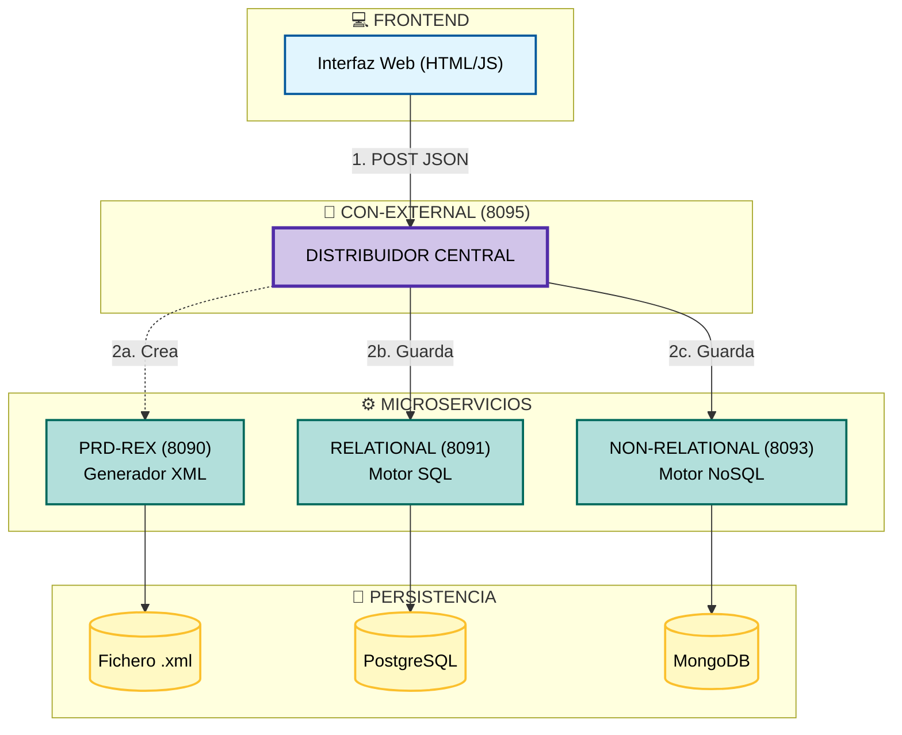
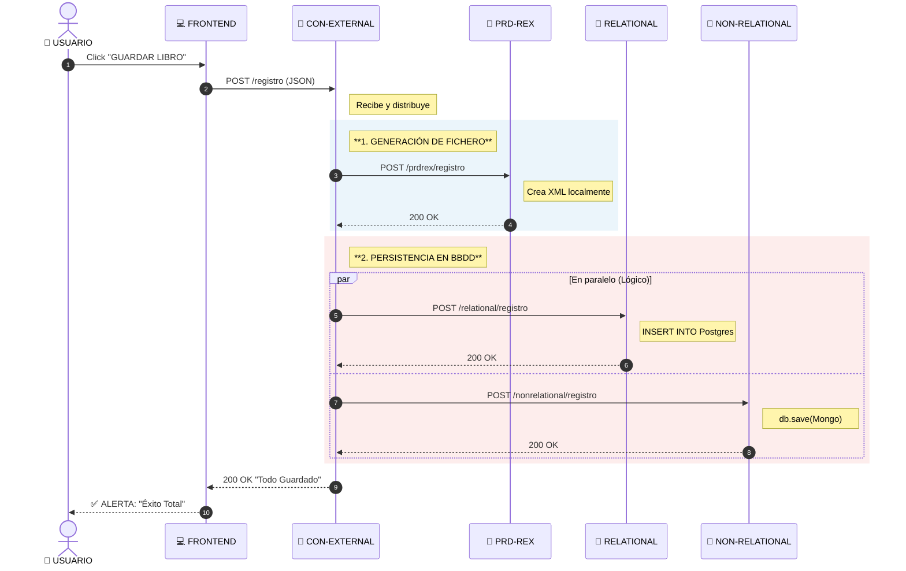

# MICROSERVICIO CHETADO 🪽

---

> [!WARNING]
> ***EL OBJETIVO DE ESTE MICROSERVICIO ES GESTIONAR EL INVENTARIO DE UNA BIBLIOTECA***

- ***El sistema implementa un patrón de persistencia políglota, almacenando simltáneamente en tres formatos distintos***
  
  - ***ARCHIVOS XML***
  - ***BASE DE DATOS RELACIONAL (POSTGRESQL)***
  - ***BASE DE DATOS NO RELACIONAL (MONGODB)***

---

## ARQUITECTURA DEL SISTEMA 🔺

### FRONTEND 🔻

> [!NOTE]
> ***INTERFAZ DE USUARIO, NO TIENE LÓGICA DE NEGOCIO, SOLO CAPTURA LOS DATOS Y LOS ENVÍA AL BACKEND***

- ***Esta página web nunca habla directamente con las bases de datos, ese rol lo tiene `con-external`, el orquestador***
  
  - ***DISEÑO 💗💗***
   
  

---

### CON-EXTERNAL 8095🔻

> [!NOTE]
> ***ES EL INTERMEDIARIO, SIENDO EL ÚNICO PUNTO DE CONTACTO CON EL FRONTEND***

- ***Recibe peticiones de usuario y decide a qué microservicio llamar basándose en la intención del usuario (Depende de la petición del usuario en la web)***
  
  - ***Para escirbir (POST) = Se encarga de distribuir el libro a los 3 destinos, manda crear un XML en `prd-rex` y ordena guardar en `Postgres` y `Mongo`***
  - ***PARA LEER (GET) = Consulta directamente a la base de datos relacional para máxima velocidad***

---

### PRD-REX 8090 🔻

>[!TIP]
> ***MICROSERVICIO DEDICADO A LA PERSISTENCIA DE FICHEROS***

- ***Utiliza la librería jackson XML para serializar los objetos java recibidos a formato XML***

---

### RELATIONAL-PRD-QUERY 8091

>[!NOTE] 
> ***USA POSTGRES PARA GUARDAR LOS DATOS ESTRUCTURADOS Y REALIZAR BÚSQUEDAS RÁPIDAS***

---

### NON RELATIONAL-PRD-QUERY

>[!NOTE] 
> ***USA MONGODB PARA GUARDAR EL DOCUMENTO JSON OCMO RESPALDO NoSQL***

---

## MERMAID PARA ENTENDER LA ARQUITECTURA Y FUNCIONAMIENTO 🏡

